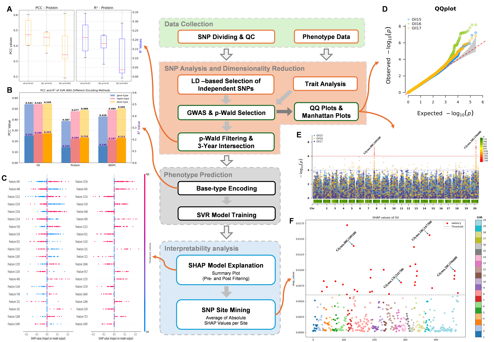

# soybean-ai
A Framework for Soybean Phenotype Prediction and Salient Loci Mining via Machine Learning and Interpretability Analysis

🌐 Project Website: [https://soybean.starhelix.cn/](https://soybean.starhelix.cn/)  
We have deployed the prediction models on this website for easy access and use by users.

# Soybean Genomic Analysis and Prediction Project

This project aims to predict soybean oil content, protein content, and water-soluble protein content based on Single Nucleotide Polymorphism (SNP) data using various machine learning (ML) and deep learning (DL) models. It also includes SHAP (SHapley Additive exPlanations) for model interpretability analysis, and performs GWAS (Genome-Wide Association Studies) analysis on the SNP data.

## Project Structure

The project contains the following folders and files:

## 📌 Main Features

### 1. **ML Folder**
- Contains machine learning models such as Support Vector Machines, Random Forests, XGBoost, etc.
- Models predict soybean oil content, protein content, and water-soluble protein content.
- Processes SNP data and trains/validates predictive models.
- Supports three SNP encoding strategies:
  
  #### 🔹 Base-type Encoding
  - Based on `.ped` files.
  - Uses 4-dimensional encoding for A, T, C, G.
  - Homozygotes: 2 on respective base; Heterozygotes: 1 on both; Missing: all zeros.
  - Example: `AA` → (2, 0, 0, 0), `CG` → (0, 0, 1, 1)

  #### 🔹 Haplo-type Encoding
  - Based on `.ped` files.
  - Homozygotes are one-hot encoded.
  - Heterozygotes and missing values are all zeros.
  - Example: `AA` → (1, 0, 0, 0), `CG` → (0, 0, 0, 0)

  #### 🔹 Gene-type Encoding
  - Based on `.raw` files.
  - Uses 0 (major homozygote), 1 (heterozygote), 2 (minor homozygote).
  - Then one-hot encoded before being input into the model.

---

### 2. **DL Folder**
- Deep learning models (e.g., neural networks) for phenotype prediction.
- Trains on SNP data similarly to ML models.
- PyTorch version used: **1.12.1**

---

### 3. **SHAP Folder**
- Uses SHAP to analyze the best-performing Support Vector Regression (SVR) model.
- Helps explain feature importance and the contribution of each SNP to predictions.

---

### 4. **data_processing Folder**
- Performs GWAS (Genome-Wide Association Studies) on SNP data.
- Includes preprocessing, statistical analysis, and result generation.
- Make sure to adjust tool paths according to your local setup.
- R scripts rely on the **CMplot** package for visualization.

---

## 🧪 Requirements

- Python ≥ 3.8  
- PyTorch == 1.12.1  
- scikit-learn  
- xgboost  
- pandas, numpy  
- matplotlib, seaborn  
- SHAP  
- R + CMplot package (for GWAS visualization)

---

## 📬 Contact

For questions or collaboration, feel free to reach out!

---

> ⭐ If you find this project helpful, consider giving it a star!

